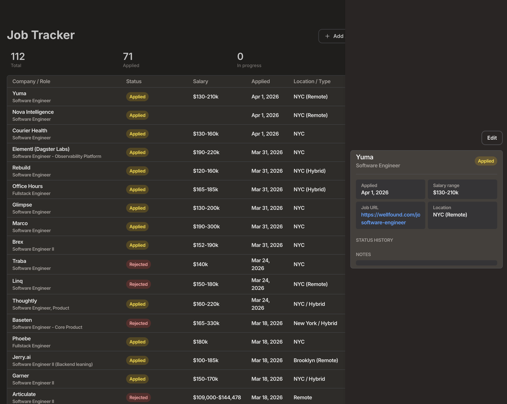

# Job Tracker

A full-stack job application tracker built with Next.js, Node.js/TypeScript, and PostgreSQL, featuring an event-driven status history pipeline powered by RabbitMQ.

**Live demo:** [job-tracker-7slu.vercel.app](https://job-tracker-7slu.vercel.app)



## Architecture

```
┌─────────────┐     ┌─────────────┐     ┌──────────────┐
│  Next.js    │ ──► │  Express    │ ──► │  PostgreSQL  │
│  (Vercel)   │     │  (Railway)  │     │  (Railway)   │
└─────────────┘     └──────┬──────┘     └──────────────┘
                           │                    ▲
                           ▼                    │
                    ┌─────────────┐     ┌──────────────┐
                    │  RabbitMQ   │ ──► │   Worker     │
                    │ (CloudAMQP) │     │  (Railway)   │
                    └─────────────┘     └──────────────┘
```

Status changes are decoupled from history persistence. When a `PATCH /applications/:id` updates an application's status:

1. The API writes the new status to PostgreSQL
2. The API publishes `{ applicationId, fromStatus, toStatus }` to RabbitMQ
3. A separate worker process consumes the message and writes a row to `status_events`
4. The frontend reads `status_events` to render the timeline in the detail panel

Running the worker as a separate service means status-history writes can fail or backlog without affecting API latency or availability.

## Stack

| Layer         | Technology                  | Hosting    |
| ------------- | --------------------------- | ---------- |
| Frontend      | Next.js 15, Tailwind v4     | Vercel     |
| Backend API   | Express, TypeScript, Zod    | Railway    |
| Database      | PostgreSQL via Prisma ORM   | Railway    |
| Message queue | RabbitMQ                    | CloudAMQP  |
| Worker        | TypeScript consumer process | Railway    |

## Features

- Add, edit, and delete job applications
- Status tracking across 10 stages (applied → screening → interview → offer, etc.)
- Gmail-style detail panel with inline editing
- Status history timeline powered by the event pipeline
- Per-application notes
- Table ordered by applied date (most recent first)

## Project structure

```
job-tracker/
├── frontend/   # Next.js app → Vercel
├── backend/    # Express API → Railway
└── worker/     # RabbitMQ consumer → Railway
```

Each service has its own `package.json` and is deployed independently.

## API

| Method | Route                | Description                                     |
| ------ | -------------------- | ----------------------------------------------- |
| GET    | `/applications`      | List all applications                           |
| GET    | `/applications/:id`  | Single application with status events and notes |
| POST   | `/applications`      | Create a new application                        |
| PATCH  | `/applications/:id`  | Update (publishes to queue if status changes)   |
| DELETE | `/applications/:id`  | Delete an application                           |

## Running locally

Each service runs in its own terminal.

**Backend** (port 3001):

```bash
cd backend
npm install
npx prisma migrate dev
npm run dev
```

Requires `DATABASE_URL` and `CLOUDAMQP_URL` in `backend/.env`.

**Worker:**

```bash
cd worker
npm install
npm run dev
```

Requires `DATABASE_URL` and `CLOUDAMQP_URL` in `worker/.env`.

**Frontend** (port 3000):

```bash
cd frontend
npm install
npm run dev
```

Requires `NEXT_PUBLIC_API_URL=http://localhost:3001` in `frontend/.env.local`.

## Deployment

- **Frontend:** Vercel, root directory `frontend/`
- **Backend & worker:** Railway, separate services pointing to `backend/` and `worker/` respectively
- **Database:** Railway Postgres, linked to both backend and worker
- **Queue:** CloudAMQP, `CLOUDAMQP_URL` set on both backend and worker

The backend's `start` script runs `prisma migrate deploy` before booting, so schema changes are applied automatically on every deploy.
